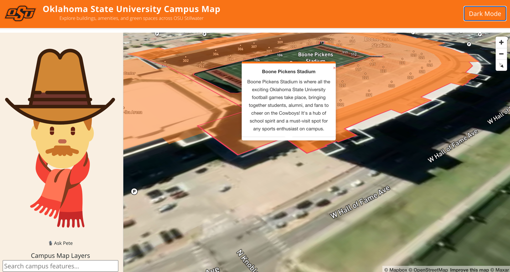

# 🛍️ Oklahoma State University OSU Explorer

An interactive web application that visualizes the Oklahoma State University (OSU) Stillwater campus. Explore buildings, amenities, and green spaces with intelligent search, real-time voice interaction, and AI-enhanced descriptions.

---



## 📋 Table of Contents

- [Features](#-features)
- [Installation](#️-installation)
- [Usage](#-usage)
- [Contributing](#-contributing)
- [Acknowledgments](#-acknowledgments)

---

## 🚀 Features

- **Interactive 3D Map**: Navigate the OSU Stillwater campus with zoom, tilt, and pitch features using Mapbox GL JS.
- **AI-Powered Popups**: Get brief, GPT-generated building descriptions when clicking on map features.
- **Voice Assistant ("Ask Pete")**: Click the mic icon and speak naturally (e.g., *"Tell me about Edmon Low Library"*).
- **WebSocket Integration**: Real-time description streaming from your backend via a persistent connection.
- **Fuzzy Search**: Type partial names or misspellings — powered by Fuse.js — to find buildings and amenities.
- **Layer Controls**: Toggle visibility of buildings, amenities, leisure areas, and land use with checkboxes.
- **Amenity Filtering**: Filter amenities by type (e.g., cafe, library, parking).
- **Feature Highlighting**: Click on features to highlight them, fly to their location, and view AI-generated context.
- **Responsive Design**: Optimized for desktop and mobile devices.
- **(Optional) Dark Mode**: Theme switcher support (if implemented in future).

---

## 🛠️ Installation

1. **Clone the repository:**

```bash
git clone https://github.com/yourusername/osu-campus-map.git
cd osu-campus-map
```

2. **Install dependencies:**

```bash
npm install
```

3. **Start the development server:**

```bash
npm run dev
# or
npm start
```

4. **Access the application:**

Open your browser and navigate to `http://localhost:3000`

---

## 📖 Usage

- **Search**: Use the sidebar search bar for buildings and features. Fuzzy matching supports typos and partial matches.
- **Click to Learn**: Click on buildings or amenities to get a brief AI description.
- **Voice Assistant**: Click 🎤 to speak with Pete! Try phrases like *"Tell me about the Engineering South"*.
- **Layer Toggle**: Show/hide layers like buildings, leisure, or landuse in the sidebar.
- **Amenity Filter**: Choose from amenity types to refine map results (e.g., show only ATMs or cafes).

---

## 🤝 Contributing

Contributions are welcome! Please follow these steps:

1. Fork the repository.
2. Create a new branch:

```bash
git checkout -b feature/your-feature-name
```

3. Commit your changes:

```bash
git commit -m 'Add your feature'
```

4. Push to the branch:

```bash
git push origin feature/your-feature-name
```

5. Open a pull request.


---

## 🙏 Acknowledgments

- 🗺️ [Mapbox](https://www.mapbox.com/) — for the dynamic mapping platform.
- 🛍️ [OpenStreetMap](https://www.openstreetmap.org/) — for detailed campus geospatial data.
- ⚛️ [React](https://reactjs.org/) — for building the frontend.
- 🧠 [OpenAI](https://openai.com/) — for GPT-based intelligent descriptions.
- 📢 [Web Speech API](https://developer.mozilla.org/en-US/docs/Web/API/Web_Speech_API) — for browser-based voice recognition.
- 🔶 OSU Brand Management — for official logo and branding guidelines.

